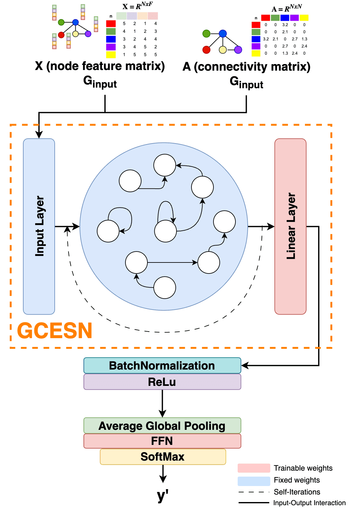
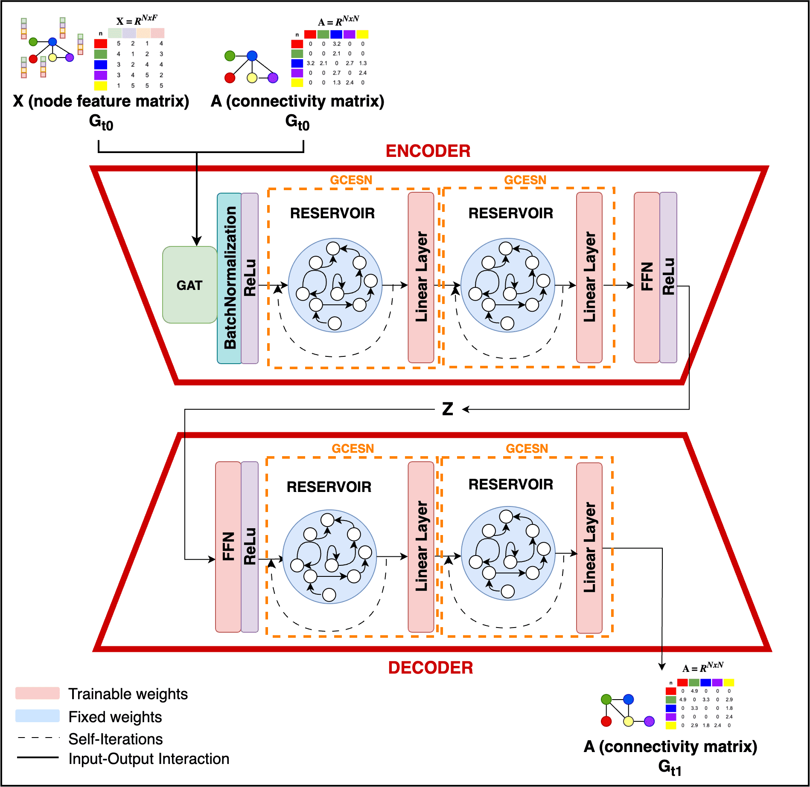

# Graph Convolutional Echo State Network (GCESN)
We proposed a reservoir-based graph convolution network, which updates node embeddings by performing graph convolution iteratively using fixed, randomly initialized reservoir weights. A single GCESN layer can perform graph convolution to integrate information from neighbouring nodes that are up to k-hops away by iterating the process up to k times. Additionally, the leaky integrator in the reservoir is designed to control the oversmoothing effect by preserving the initial node embedding during node aggregation.

GCESN consits of three components, which are the input layer, the graph convolution reservoir layer, the and the linear output layer. In our study, we implemented the GCESN for graph classification and generation tasks.


### GCESN Implementation for Graph Classification
GCESN implementation in a graph classification model is illustrated in the figure below:


### GCESN Implementation for Graph Generation 
GCESN implementation in a graph transformer model for brain evolution prediction is illustrated in the figure below:


## Source Code
#### Installation
GCESN was developed using Python version 3.10.12 with CUDA toolkit v12.0. All library that is used for running GCESN codes are available in [requirements.txt](requirements.txt). Before running all codes in this repository, installed all the required libraries by running the following command on terminal

```
pip install -r requirements.txt
```

### File structure
| File | Description |
| ------ | ------ |
| dataset/ | folder contains connectomic graph dataset for graph generative tasks |
| models/ | folder contains all stored model throughout all experiments |
| graph-preprocessing.ipynb | code to preprocess the graph dataset |
| graph-eda.ipynb | code to do exploratory data analysis on the graph dataset|
| experiments-classification_num_layers.ipynb | code to do experiments on graph classification using with varying number of GCESN layers |
| experiments-classification_reservoir_params.ipynb | code to do experiments on graph classification using with varying GCESN reservoir parameters |
| experiments-generation_benchmark_models.ipynb | code to do experiments on brain graph evolution prediction using benchmark models (Identity function, RBGM, EvoGraphNet)|
| experiments-generation_transformers_models.ipynb | code to do experiments on brain graph evolution prediction using proposed graph transformer models|
| experiments-node_features_init.ipynb | code for running simple experiments on different node feature initialization method|

## Dataset
### Graph Classification Dataset
Graph classification dataset in our code are from graph TUDataset as part of ```torch.geometric``` library. 

### Graph Generation Dataset
All graph data used as input for graph generation code in this repository must include an adjacency matrix and a node feature matrix, both in NumPy array format with the following shape:
- The adjacency matrix shape: (n_samples, n_timepoints, n_nodes, n_nodes) 
- The node feature matrix shape: (n_samples, n_timepoints, n_nodes, feature_dim)

The [dataset](datasets/) folders contain the adjacency and node feature matrices that processed using code in [graph-processing.ipynb](graph-processing.ipynb). The description of all dataset files are as follows:
| Filename | Description |
| ------ | ------ |
| emci-ad-adj.npy |  Numpy Array with shape (67,2,35,35) contains structural brain graph connectivity matrices of 67 subjects in 2 timepoints derived from EMCI-AD Dataset [1]  |
| emci-ad-laplacian_features.npy | Numpy Array with shape (67,2,35,8) contains 8-dimensional Laplacian Encoding of nodes of EMCI-AD [1]  brain graphs |
| simulated-adj.npy | Numpy Array with shape (100,3,35,35) contains structural brain graph connectivity matrices of 100 subjects in 3 timepoints dgenerated by simulating brain graph trajectory data [2]|
| simulated-laplacian_features.npy | Numpy Array with shape (100,3,35,35) contains structural brain graph connectivity matrices of 100 subjects in 3 timepoints generated by simulating brain graph trajectory data [2]|
| slim160-adj.npy | Numpy Array with shape (109,3,160,35) contains functional brain graph connectivity matrices of 109 subjects in 3 timepoints  from SLIM160 Dataset [3] |
| slim160-laplacian_features.npy | Numpy Array with shape (109,3,160,8) contains 8-dimensional Laplacian Encoding of nodes of SLIM160 [3] brain graphs |

More details on these connectomic dataset are available on [dataset_description.pdf](dataset_descriptions.pdf)

## References
[1] Mueller SG, Weiner MW, Thal LJ, Petersen RC, Jack C, Jagust W, et al.. The
Alzheimer’s disease neuroimaging initiative; 2005.

[2] Demirbilek O, Rekik I. Predicting the evolution trajectory of population-driven connectional brain templates using recurrent multigraph neural networks. Medical Image Analysis. 2023;83.

[3] Liu W, Wei D, Chen Q, Yang W, Meng J, Wu G, et al. Longitudinal test-retest
neuroimaging data from healthy young adults in southwest China. Scientific
Data. 2017;4.